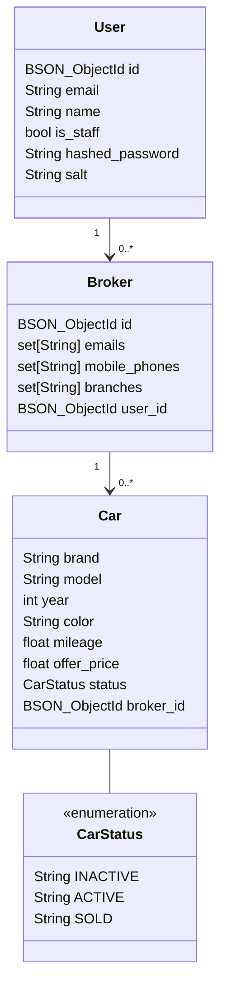

# FastAPI + MongoDB + Docker - Wheel Wonder World

web-based platform for selling cards and automobile

## Development

### 1. (optional) Create Virtual Environment

I may suggest to create virtual environment in your local project. It very helpful for types, classes, hints.\
This project use python 3.10
after created virtual enviroment, install packages via command

```bash
pip install -r requirements.txt
```

### 2. Run project

You can simply run project with docker compose via command

```bash
docker compose up
```

## Swagger

- [Swagger {base_url}/docs/](http://localhost:8000/docs/)

## Simple Diagram



## Load Mockup Data

In this project provided an API to create mockup cars for a broker

### Required

1. User account
2. Broker data

### How to

You can simply load mockup cars data by requesting API via [Swagger](http://localhost:8000/docs/).

1. Create a new user via `/register/` API if you don't have an user account
2. Logged in to Swagger by press **Authorize** button
   1. username input: fill your email address
   2. password input: fill your password
3. Create a new broker via `/brokers/` API otherwise if you already have broker you can get all your brokers via `/brokers/me/` API
4. Load mockup car data to your broker via `/test/cars/{broker_id}`
